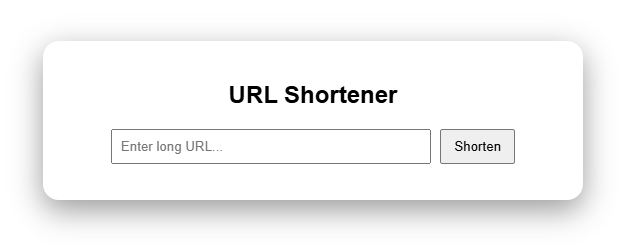
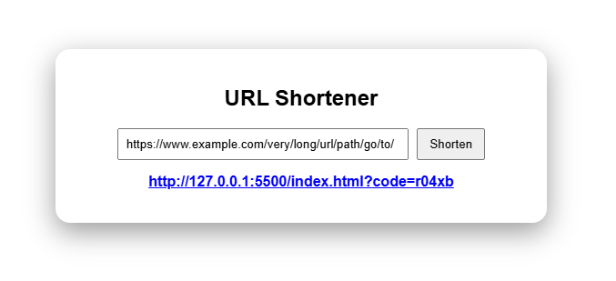

# 🔗 URL Shortener


---

## Overview

A simple and lightweight web application that converts long URLs into short, shareable links.

This project demonstrates **basic URL mapping and redirection logic**, making it a great introduction to how real-world URL shorteners work.

---

## Why This Project?

URL shorteners are widely used in:
- Social media sharing  
- Marketing campaigns  
- Analytics tracking  
- Clean and readable links  

This project focuses on building the **core logic behind link shortening and redirection**.

---

## Features

- Convert long URLs into short links  
- Instant link generation  
- Redirect to original URL  
- Minimal and clean UI  
- Responsive design  

---

## Preview

### UI


### Input URL -> Shortened Output


---

## Tech Stack

- HTML5  
- CSS3  
- JavaScript (Vanilla)

---

## How to Run

```bash
git clone https://github.com/your-username/url-shortener.git
cd url-shortener
```

Then open:
```
index.html
```
## Example

Input URL:
```
https://www.example.com/very/long/url/path/go/to/
```
Shortened Output:
```
http://127.0.0.1:5500/index.html?code=r04xb
```

## Future Improvements
- Backend with database (persistent links)
- Custom short URLs
- Analytics (click tracking)
- Link expiration
- Authentication system

## What I Learned
Handling URL validation and transformation
Working with dynamic DOM updates
Understanding mapping logic (short ↔ original)
Building clean and simple UI/UX

## Contributing

Pull requests are welcome!
Feel free to enhance features or improve UI.

## Show Your Support

If you found this useful, consider giving it a ⭐ on GitHub!
